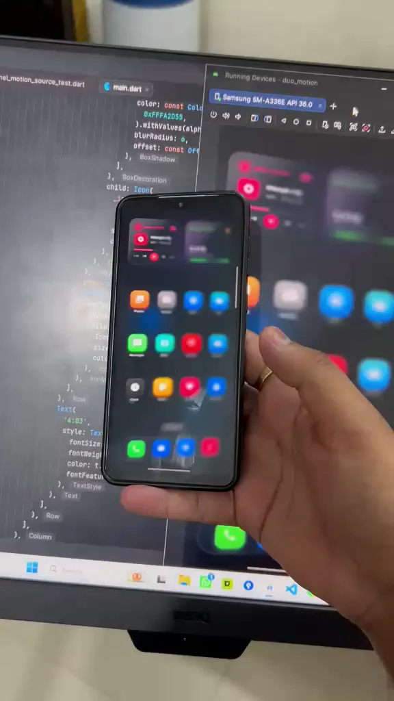

# DuoMotion Showcase Example

<p align="center">
  
</p>

This example demonstrates the **iPhone Duo / SoloTilt** frosted-glass 3D perspective fold effect using `duo_motion`.

## Features Demonstrated

- **Real-Time Gyroscope Tilt**: Live device attitude tracking using hardware sensors (`FoldController.useSensor = true`).
- **3D Pinhole Ray-Traced Optics**: Observer perspective foreshortening with progressive depth-of-field blur on Impeller shaders.
- **Glassmorphic Interactive UI**: Frosted glass cards, live dynamic equalizer, rotating vinyl disc, and authentic iOS dock.
- **Bi-Directional Gesture Control**: Touch dragging with snappy second-order physics return.
- **Multi-Theme Support**: Obsidian Midnight Dark, Pure White, Ocean Blue, Neon Purple, and Emerald Mint.

## Running the Example

Make sure you have Flutter installed and a device or emulator running:

```bash
cd example
flutter pub get
flutter run
```
